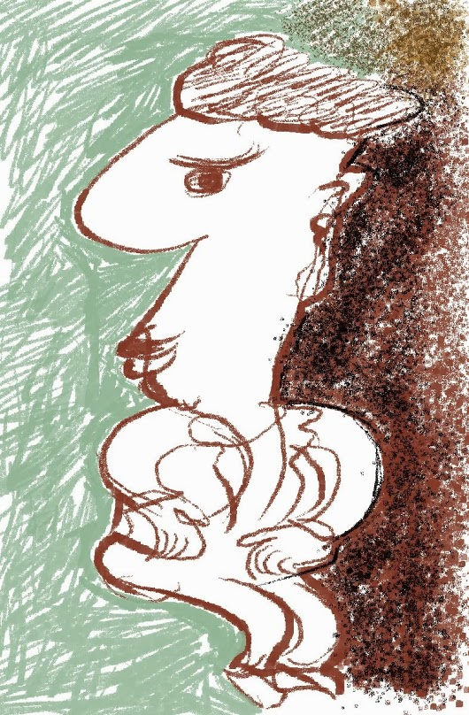
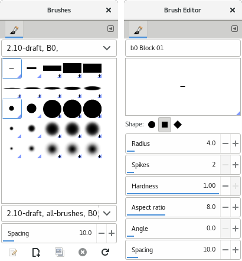
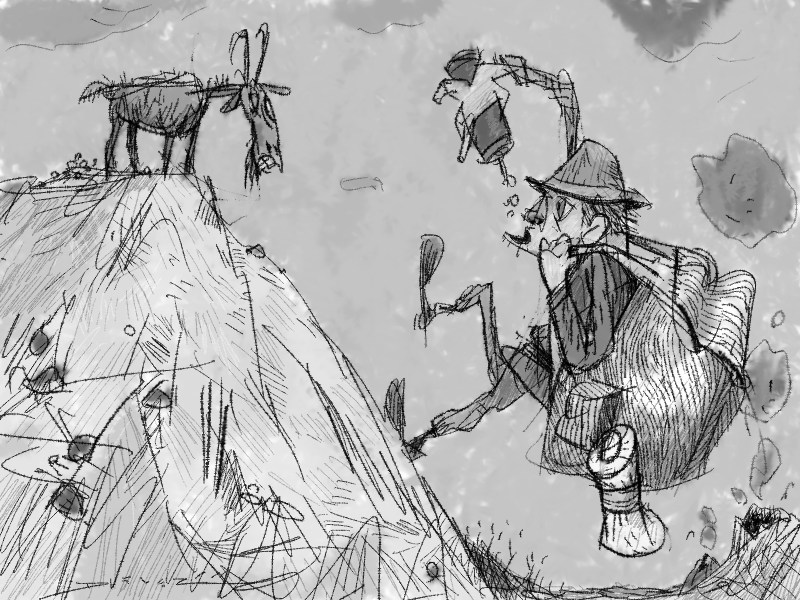
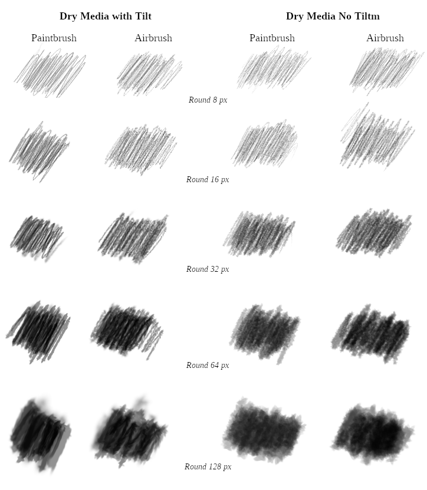
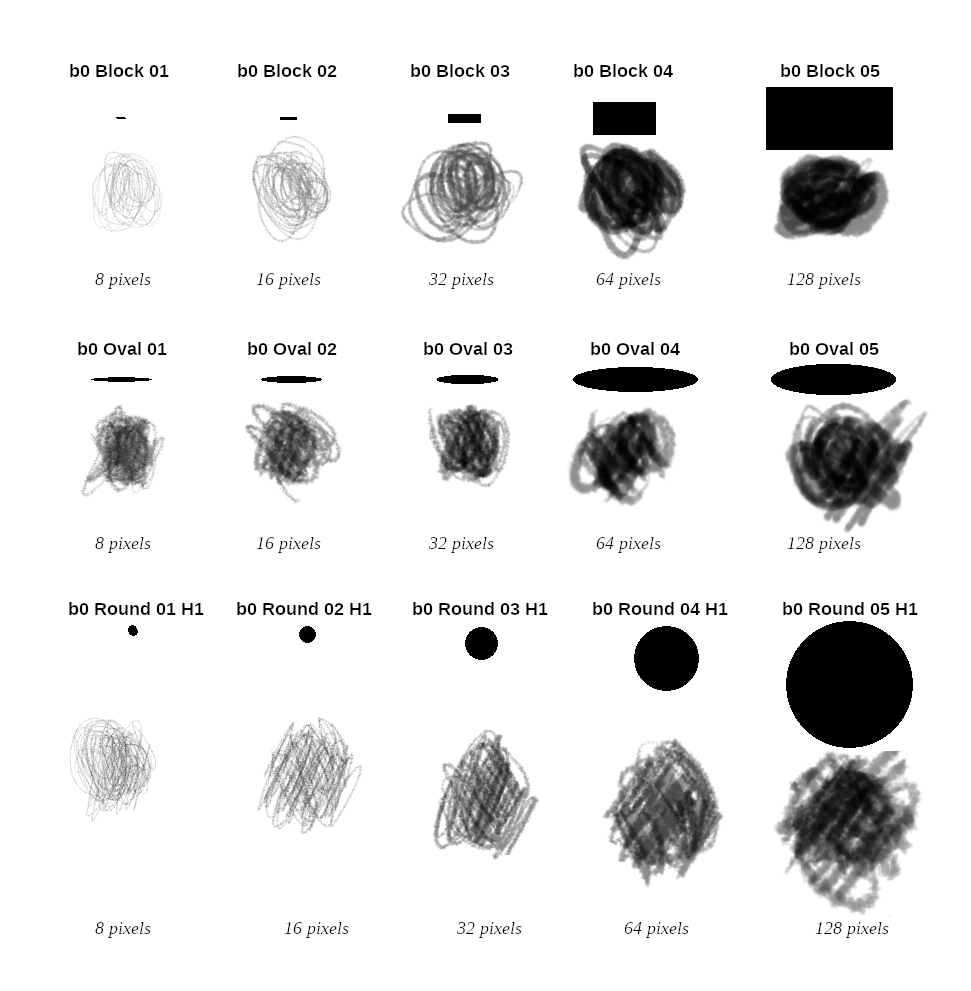
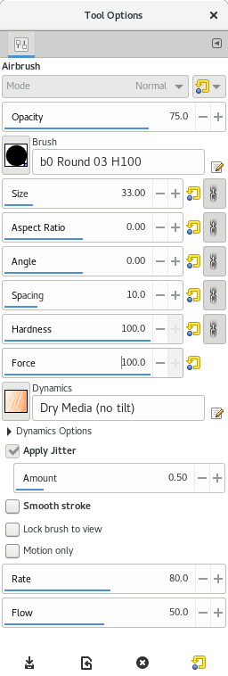

# Parametric Brush
Author: Americo Gobbo 
Date: 2018 June

<figure>
<figcaption> A fast sample made in 2013 by Americo Gobbo with Dry Media paint dynamics and parametric brushes.</figcaption>
</figure>

### GIMP Brushes
GIMP provides two very different types of brushes: the parametric (.vbr) and raster (.gbr and .gih).
The scope of this article mainly demonstrates the quality and possibility of parametric brushes. I am writing a dedicated article about the GIMP brushes and I have pasted the short intro about them:

> The parametric brush is a vector brush and it has the great possibilities and flexibility for many tasks in different tasks and branches (graphic design, photography, digital painting, etc...)
The raster brush is also versatile and has great pictorial qualities but, is more complex to build because is managed as an image.
Probably the choice, between raster and/or parametric brush, is done by the kind of task, the painter style and of his/her artistic background/knowledge/taste, etc.

## The Parametric Brush and Painting Techniques
It seems artists haven't yet realized the full usefulness and versatility of GIMP's parametric brushes, especially when paired with the proper dynamics. This article shows how to use parametric brushes to make convincing emulations of dry media such as pencil, color pencil, charcoal, chalk and pastel.
<figure> <figcaption>Brush set and Parametric Editor (.vbr).</figcaption></figure>

The default shapes are round, square and diamond. Is also possible create a great variation of the shapes, using the different parameters to control the shape and its aspect (radius, spikes, hardness, aspect ratio, angle and spacing).

Some of the advantages of parametric brushes are:
* The stroke of the parametric brush is more sharpest and hard when we use hardness equal 1 than with the raster brushes,
* Is much easy to increase/decrease the hardness, is applied correctly, via own editor or via Tool Options … instead, the .gbr and .gih brushes, when we increase/decrease the hardness, the stain is deformed by the blur algorithm: [Comparison test between hardness and Force with .gbr and .vbr brushes](https://gitlab.gnome.org/GNOME/gimp/issues/1081 "Issue #1081")

### Dry Media Experiments
In 2013, I began study the dry media with parametric brushes, they are essentially the drawing tools as pencil, crayon, charcoal and pastel.
I have invited also Gustavo Deveze and Elle Stone to use my parametric brush set with 2 paint dynamics dedicated exclusively to dry media.

<figure> <figcaption>Gustavo Deveze drawing with the Dry Media paint dynamics with the brush set of parametric brushes.</figcaption></figure>

#### Paintbrush and Airbrush Tool
To explore the dry media effects with parametric brushes, I have revised, initially in 2013, the Pencil Generic Paint Dynamics to adapt better it to other dry media.
After to work much with the variations of Pencil Generic... I have found a good compromise, but the methodology was complex and based only on trial and error.

> I have thought interesting to understand better the real media and to try a way to modeling the effects via paint dynamic making a good screening of real variables on these media, the is demonstrated good to modeling the first steps or the main aspects of this media. This methodology I will describe in another article.

I have verified, also, that is possible to use different tools, pencil, paintbrush and airbrush, but, effectively the airbrush is more interesting, mainly of the Rate and Flow controls.

<figure> <figcaption>Samples using round parametric brushes of the set with my paint dynamic Dry Media.</figcaption></figure>

In general, all size brushes are working well, but mainly between 8 ~ 64 pixels it seems the better compromise. The large brushes are interesting for covering large areas and is not possible to have a good shape, they are appearing a bit soft.

## Parametric Basic Brush Set and Paint Dynamics | Download
<figure> <figcaption>Samples using round parametric brushes with different shapes with Airbrush tool. Tool.</figcaption></figure>

The brush set, in 'B0' folder, contains the .vbr basic brushes, round and block (hard and soft versions). The paint dynamics are two: for the graphics tablet's stylus with tilt and not. The version with tilt is fun to use and is possible to emulate well the effect when you are inclining the tool in the real cases.

> In general, it seems that users prefer to pick the brushes directly on the dialog palette. The parametric brush is so easy to modify and create our own set... but many people don't have time and 'energy' to build own our brushes. To those, that they think that is a large set they could delete the brushes not usable for them.

Download [Brush Set + Paint Dynamics](parametric-brushes.assets/parametric-brushes-Brushset-and-paint-dynamics.zip "Parametric Brush Set + Dry Media Paint Dynamics").

## Tool Options Settings
To emulate better the dry media I recommend to use Airbrush Tool with this setting conditions on Tool Options:
* Opacity 75 ~ 100
* Enable the Jitter and use values between 0.5 ~ 0.75 circa.
* Force¹ at 100% (normally is 50% by default).
* Rate between 75 to 125
* Flow around 50
* Motion Only, read this [excerpt](https://goo.gl/PLTUKt "About Motion Only to the Airbrush tool") of The Book of GIMP: A Complete Guide to Nearly Everything. By Olivier Lecarme, Karine Delvare. 
*¹ Only to GIMP 2.10 and 2.99 Devel.*

<figure> <figcaption>Airbrush, my proposal of the settings to the dry media effects.</figcaption></figure>

We have tested on GIMP 2.10, 2.99 and 2.8 with good results.

### Author, License (Brush Set and Paint Dynamics)
Created by Americo Gobbo and licensed as Public Domain.

### Acknowledges
To Elle Stone and Gustavo Deveze to help me with paint dynamics tests and images to illustrate this document. Also, thanks to Patrick David to give me support in the gitlab and formatting of the article to gimp.org.
