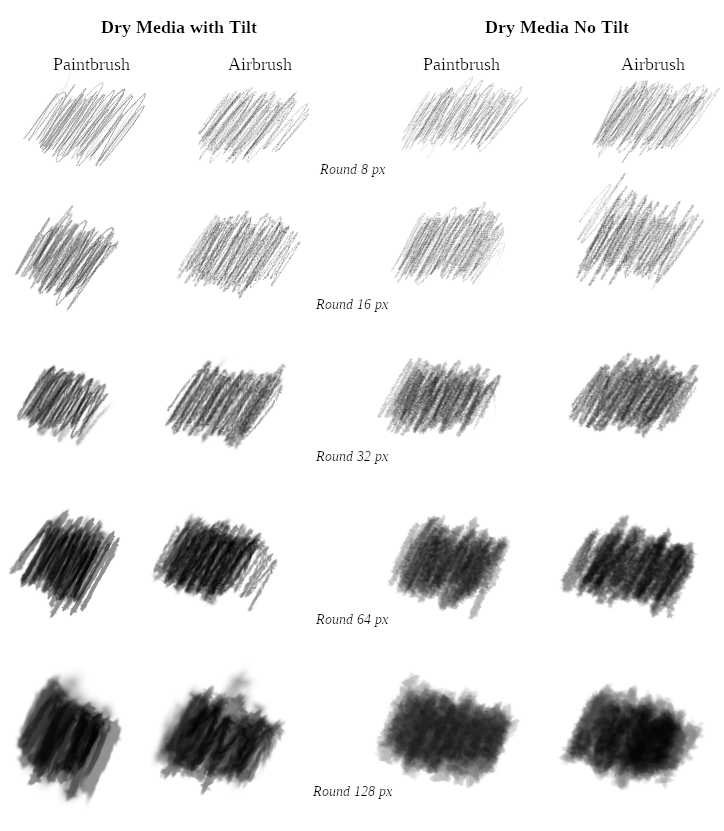

# Parametric Brush
Author: Americo Gobbo 
Date: 2018 June

<figure>
<figcaption> A fast sample made in 2013 by Americo Gobbo with Dry Media paint dynamics and parametric brushes.</figcaption>
</figure>

## The Parametric and Pictorial Techniques
The idea to put in evidence these brushes is motivated by the real possibilities of the parametric brushes on GIMP to solve many issues of pictorial techniques with a simple and dedicated paint dynamics.

On GIMP the brush set have a small amount of parametric brushes… why reason? Sincerely I do not know, perhaps, many illustrators, concept artists, photographers have been accustomed to see/utilize only raster brushes.
The main scope of this article is to see the misused of parametric brush on GIMP and to demonstrate how is possible to use the parametric brush with paint dynamics to emulate many kind of media, for instance, the dry media.

 *Brush set and Parametric Editor*

The default shapes are round, square and diamond. Is also possible create a great variation of the shapes, using the different parameters to control the shape and its aspect (radius, spikes, hardness, aspect ratio, angle and spacing).

The stroke of parametric brush is more sharpest and hard when we use hardness equal 1 when we compare with the raster brushes, is much easy to increase/decrease the softness via own editor or via Tool Options … instead the .gbr when we increase/decrease the hardness the stain is deformed by the blur algorithm how is possible in this gitlab issue: [Comparison test between hardness and Force with .gbr and .vbr brushes](https://gitlab.gnome.org/GNOME/gimp/issues/1081 "Issue #1081")

### Dry Media Experiments
I thought to begin with classic main dry media as pencil, crayon, charcoal and pastel.

<figure> <figcaption>Gustavo Deveze drawing with the Dry Media paint dynamics with the brush set of parametric brushes.</figcaption></figure>

#### Paintbrush and Airbrush Tool
To explore the dry media effects with parametric brushes, I have revised a bit the Pencil Generic Paint Dynamics
to adapt better it to other dry media and it is [here.](parametric-brushes.assets/parametric-brushes-Dry-Media.zip "Dry Media Paint Dynamics").
Is possible to use different tools, pencil, paintbrush and airbrush, but, effectively the airbrush is more interesting.

<figure> <figcaption>Samples using round parametric brushes of the set with my paint dynamic Dry Media.</figcaption></figure>

## Parametric Basic Brush Set and Paint Dynamics | Download
The brush set contains the .vbr basic brushes, round and block (hard and soft versions). The 'B0' folder contains the .vbr basic brushes, round and block (hard and soft versions).

Download [Brush Set + Paint Dynamics](parametric-brushes.assets/parametric-brushes-Brushset-and-paint-dynamics.zip "Parametric Brush Set + Dry Media Paint Dynamics").

## Tool Options Settings
To emulate better the dry media is necessary also some Tool Options setting conditions enabled.
* Enable the Dynamic Options > Fade > Use 100 and '%' unit.
* Enable the Jitter and use values between .5~1.0 circa.
* Incremental Option On.
* Force(¹) at 100% (normally is 50% by default).
*(¹)Only to GIMP 2.10 and 2.99 Devel.*

We have tested on GIMP 2.10, 2.99 and 2.8 with good results.

### Author, License
Created by Americo Gobbo and licensed as Public Domain.
